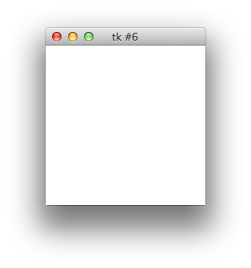
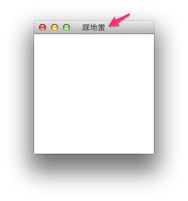
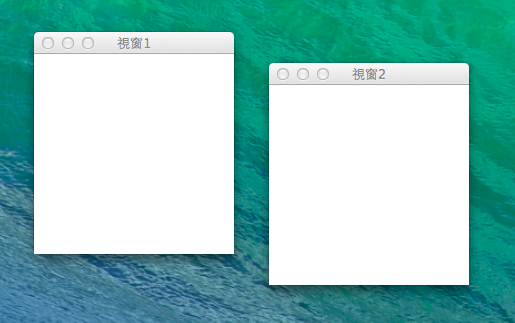
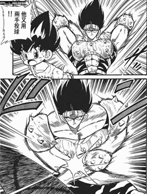
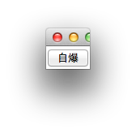
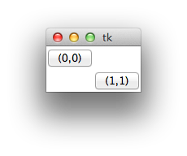
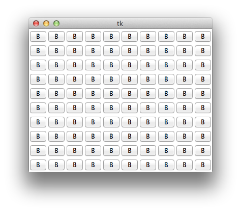

# 從踩地雷認識 OO

下面的練習，請先 import Tkinter. 之後的例子都不會重覆這一行。

```python
import Tkinter
```
## 運作環境


## 如何使用 Tkinter

1. Python 官網文件是基本觀念
2. Tk 的介文件


### 優點
* 內建，馬上就可以用
* 不難

### 缺點
* 要看 Tcl/Tk 的文件

### 還可以學什麼?
* wxWIdget, pyQT, jython


馬上就跳級打怪 .....


## TK 視窗管理員(Window Manager)

視窗管理員是一個 GUI 程式通常都有的基本外殼，不多說，直接試一下。

程式碼:
```python
wm = tkinter.Tk()
```


程式碼:
```python
wm.title("踩地雷")
```


每一個程式都有視窗管理員，這在一般的 tkinter tutorial 沒有強調，因為若是你沒有設定，那就會自動幫你建一個. 所以在寫簡單自用的程式的時候，是用不到的。但若要調整視窗的屬性(e.g.標題)的話，那就需要了。或是需要要一次出現兩個視窗的，那就要分別把兩個不同的視窗管理員建立起來。


### 一個視窗不夠，你可以建兩個
程式碼:
```python
wm1 = tkinter.Tk()
wm2 = tkinter.Tk()
wm1.title("視窗1")
wm2.title("視窗2")
```


再一次強調， Tk() 可以建立一個視窗管理員，而視窗管理理員是每一個 GUI 程式的根。

### 交換順序

恩，自已寫程式就可以弄一些好玩的東西:


```python
wm1.lift()
wm2.lift()
```
可以先把兩個視窗管理員疊在一起，再交替執行上面的 Code。

### 離題: ipython 的即時讀文件功能

好，剛剛的 title 是上面的文字講的，那如果我們想確定 title 的用法呢? ipython 有一個特異功能，就是在函式的後面加上問號以後，就可以立刻看到文件。

程式碼:
```python
wm1.title?
```

```bash
In [3]: wm.title?
Type:        method
String form: <bound method Tk.wm_title of <tkinter.Tk object at 0x10ce855d0>>
File:        /usr/local/Cellar/python3/3.3.2/Frameworks/Python.framework/Versions/3.3/lib/python3.3/tkinter/__init__.py
Definition:  wm.title(self, string=None)
Docstring:   Set the title of this widget.
```
最後三行非常的有用，有函式所在的檔案路徑，定義還有文件。


## Tk 元件( Widget )

建立一個視窗管理員是第一步，接著來建立一個按鈕Button 。


程式碼:
```python
b = tkinter.Button(wm1, text='自爆')
b.grid()
```


點把，不會自爆的。

### Tk 設定值

不好看，想調整寬度。


```python
b['width']
```
這樣會印出基本的寬度設定。

```python
b['width'] = 100
```
把寬度設定為 100


### Tk 元件(widget)有多種設定方式

Tkinter 的元件( widget ) 使用字典型式的設定, 這是一個很清楚的設定方式, 但也同時提供其他的設定方式。

```python
b.config(width=100)
b.configure(width=15)
```
恩... 選一個喜歡的方式吧。

### TK 元件有什麼東西可以設定呢?

大哉問，這可以找到很多的資料的。但是當你大致知道以後，請不要忘記看文件
```python
tkinter.Button?
```

```bash
Type:            type
String form:     <class 'tkinter.Button'>
File:            /usr/local/Cellar/python3/3.3.2/Frameworks/Python.framework/Versions/3.3/lib/python3.3/tkinter/__init__.py
Init definition: tkinter.Button(self, master=None, cnf={}, **kw)
Docstring:       Button widget.
Init docstring:
Construct a button widget with the parent MASTER.

STANDARD OPTIONS

    activebackground, activeforeground, anchor,
    background, bitmap, borderwidth, cursor,
    disabledforeground, font, foreground
    highlightbackground, highlightcolor,
    highlightthickness, image, justify,
    padx, pady, relief, repeatdelay,
    repeatinterval, takefocus, text,
    textvariable, underline, wraplength

WIDGET-SPECIFIC OPTIONS

    command, compound, default, height,
    overrelief, state, width
```
上面的文件，可以看出所有的元件有什麼東西可以調。以及特定的元件可以調整什麼? 這裡可以看到只有按鈕可以設定 command, 而command 就是按了按鈕後所會執行的動作。

### 練習
請像上面把玩 width 的方式，來玩玩按鈕的一些屬性。

* justify
* state
* highlightbackground
* text

上面的的值當然要先 Google 一下，但是你也可以在 ipython 內玩玩亂設定

### Command

```python
def my_command():
	print("pressed")
b['command'] = my_command # b is a button instance
```

###  Command 練習
取代 print("pressed") 這一行。
讓按了一下後，文字變成 'pressed'


## Tk Geometry in command line

有了元件，接下來要做的事情，就是如何把元件如何擺放在畫面上。
接下來使用的是把畫面等分的 Grid Layout. 也就是把畫面當成棋盤格擺放。


### Grid Layout

初探!


```python
import tkinter
root = tkinter.Tk()
button1 = tkinter.Button(root, text="(0,0)")
button1.grid(row=0, column=0)
button2 = tkinter.Button(root, text="(1,1)")
button2.grid(row=1, column=1)
root.mainloop()
```
一個 Widget 需要你關心的事情，一個是長相，另一個就是如何擺放。不找個地方擺放的話，在畫面上是看不到的。


練習:
你可以舉一反三做出下面的 Layout 嗎?



```python
import tkinter
root = tkinter.Tk()
for row  in range(10):
    for col in range(10):
        button = tkinter.Button(root, text="B")
        button.grid(row=row, column=col)
root.mainloop()
```

不錯的 Callback
```python
import tkinter
root = tkinter.Tk()
class ButtonCommand:
    def __init__(self, x,y):
        self.x = x
        self.y = y
    def on_click(self):
        print( "%d %d" % (self.x, self.y))
for row  in range(10):
    for col in range(10):
        button = tkinter.Button(root, text="B")
        command = ButtonCommand(row, col)
        button['command'] = command.on_click
        button.grid(row=row, column=col)
root.mainloop()

```

2號
```python
import tkinter
root = tkinter.Tk()

class CB(tkinter.Button):

	def __init__(self, master=None, cnf={}, row=0, col=0, **kw):
		super(CB, self).__init__(master, cnf, **kw )
		self.__row = row
		self.__col = col

	def print_name(self):
		print("(%d,%d)"%(self.__row, self.__col))

for row in range(10):
	for col in range(10):
		button = CB(root, row=row, col=col, text="B")
		button.grid(row=row, column=col)
		button['command'] = button.print_name
root.mainloop()


```

### 踩地雷

更進一步! 開始造出踩地雷的元件!

1. 拆解問題
1. 踩地雷的元件


* 畫面只會由按鈕構成。
* 按鈕後面暗藏玄機，按了以後，如果是炸彈，那就顯示炸彈。如果不是，就顯示附近炸彈的數量


### 一般 GUI 的程式的想法

* One Way Data Flow
* Model Your Thought

* 把問題簡化成 將資料視覺化。
* 一個 UI 元件做的事情越簡單越好
* 上層的元件處理元件跟元件間的互動。


#### Python 基礎的熱身

* 如何表達座標? 座標指到的資料又如何存?
* 到時的 Button 的行為我們學習如何客制化

我們計畫用字典(()Dictionary)這個資料結構來表達座標，下面是一些字典的範例:
```python
a = {}
a[10] = 100
a['the coolest language'] = 'python'
print(a) # {10: 100, 'the coolest language': 'python'}
```

可以用 tuple 當做key
```python
a[ (0, 2) ] = 'no bomb'
a[ (0, 1) ] = 'bomb'
print(a) # {(0, 1): 'bomb', (0, 2): 'no bomb'}
```

客製化一個 Button
```python
class BombButton(tkinter.Button):
    def __init__(self, master=None,  *args,  **kwarg):
        super(BombButton, self).__init__(master, *args, **kwarg)
        self['text'] = "xxx"
		  # you do more thing in the futuer
a = BombButton()
a.grid()
```
在 __init__ 後面，你可以自已做更多的事情.

### 踩地雷的程式

```python
try:
    import tkinter
except ImportError as e:
    import Tkinter as tkinter


LAYOUT ={
    (0, 0): 0, (0, 1): 0, (0, 2): 0,
    (1, 0): 1, (1, 1): 0, (1, 2): 0,
    (2, 0): 0, (2, 1): 0, (2, 2): 0,
}

GAME_NUMBERS = {
    (0, 0): 1, (0, 1): 1, (0, 2): 0,
    (1, 0): 0, (1, 1): 1, (1, 2): 0,
    (2, 0): 1, (2, 1): 1, (2, 2): 0,
}

class BombButton(tkinter.Button):
    def __init__(self, master=None, has_bomb=0, bomb_number=0, x=0,y=0,
                 non_bomb_callback=lambda x:x, *args,  **kwarg):
        super(BombButton, self).__init__(master, *args, **kwarg)
        self['command'] = self.on_click
        self.has_bomb = has_bomb
        self.x = x
        self.y = y
        self.non_bomb_callback = non_bomb_callback
        self.bomb_number = bomb_number
        self.navigated = False

    def on_click(self):
        if self.navigated:
            return
        self.navigated = True

        if self.has_bomb:
            self['text'] = 'X'
            return

        if self.bomb_number == 0:
            self.non_bomb_callback(self)
            return
        self['text'] = str(self.bomb_number)


class Application(tkinter.Tk):
    @staticmethod
    def __get_sibling_coordination(x,y):
        for dx in (-1, 0, 1):
            for dy in (-1, 0, 1):
                if dx == 0 and dy == 0:
                    continue
                if (x+dx,y+dy) in LAYOUT.keys():
                    yield x+dx, y+dy
    def __init__(self, *args, **kwarg):

        super(Application, self).__init__(*args, **kwarg)
        self.buttons = {}

        for row_index,col_index in LAYOUT.keys():
            has_bomb = LAYOUT[row_index,col_index]
            bomb_number = GAME_NUMBERS[row_index,col_index]
            b = BombButton(self, x=row_index,
                           y=col_index,
                           has_bomb=has_bomb,
                           bomb_number=bomb_number,
                           non_bomb_callback=self.non_bomb_callback)
			  b.grid(row=row_index, column=col_index)
            self.buttons[ row_index, col_index ] = b

    def non_bomb_callback(self, button):
        for sx, sy in Application.__get_sibling_coordination(button.x, button.y):
            sibling = self.buttons[ sx,sy ]
            sibling.on_click()


if __name__ == '__main__':
    app = Application()
    app.mainloop()
```


####進階架構調整


